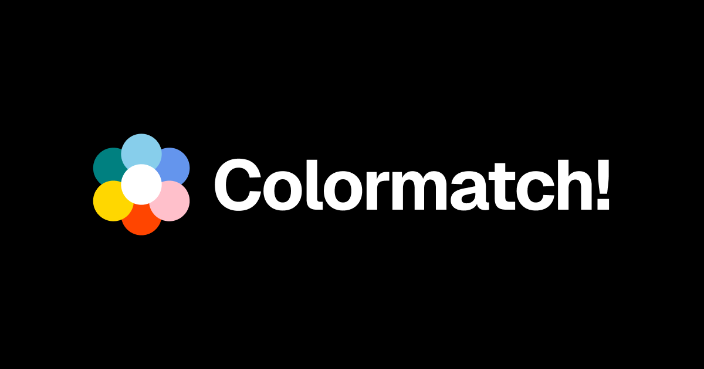
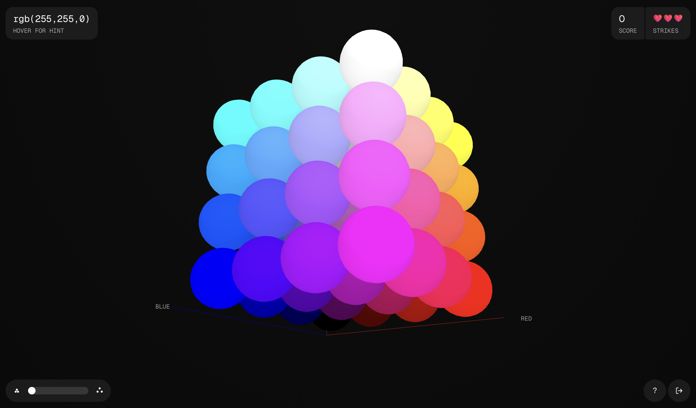
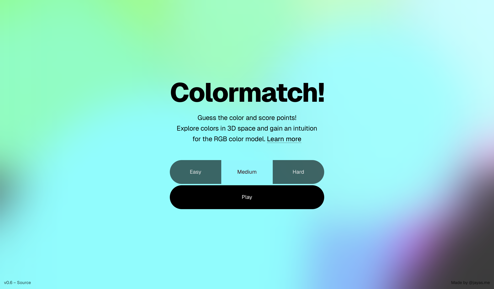

# Colormatch!

A color matching game built over the weekends\*. Aims to familiarize players with the RGB color model.

Check it out at [colormatch.jayas.me](https://colormatch.jayas.me)

## Built with

- [Svelte](https://svelte.dev/)
- [TypeScript](https://www.typescriptlang.org/)
- [Threlte](https://threlte.xyz/) - Declarative wrapper over Three.js, for Svelte
- [Runed](https://runed.dev/) - Used the Finite State Machine for game flow

## Screenshots

## Acknowledgments

- This project uses [Fluent Emoji](https://github.com/microsoft/fluentui-emoji), © Microsoft Corporation, under the MIT License. Fluent Emoji is a trademark of Microsoft Corporation.

---

\* This project started as a weekend experiment with Threlte, a declarative API over Three.js.
The 3D cube was a quick prototype to explain the RGB color model to someone.
After a few more weekends, it evolved into a polished mini-game that helps players understand the RGB notation with a score/strike game mechanism.

If nothing else, this project helped me explore designing with code and building something end-to-end.
I'm still relatively an amateur with bigger systems of code, so any feedback or contributions are welcome!

The source code is available under the [MIT license](LICENSE).
